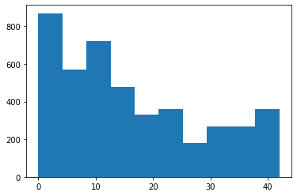
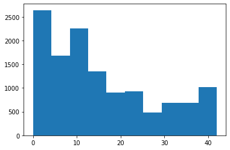
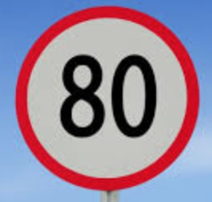
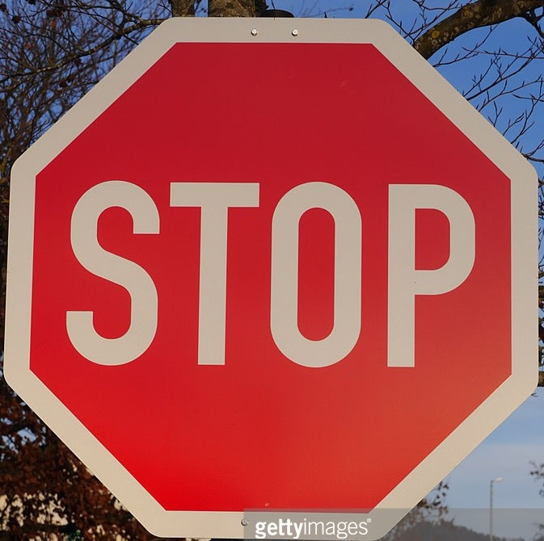

# **Traffic Sign Recognition** 

## Writeup

### You can use this file as a template for your writeup if you want to submit it as a markdown file, but feel free to use some other method and submit a pdf if you prefer.

---

**Build a Traffic Sign Recognition Project**

The goals / steps of this project are the following:
* Load the data set (see below for links to the project data set)
* Explore, summarize and visualize the data set
* Design, train and test a model architecture
* Use the model to make predictions on new images
* Analyze the softmax probabilities of the new images
* Summarize the results with a written report

[//]: # (Image References)

[image1]: ./examples/visualization.jpg "Visualization"
[image2]: ./examples/grayscale.jpg "Grayscaling"
[image3]: ./examples/random_noise.jpg "Random Noise"
[image4]: ./examples/placeholder.png "Traffic Sign 1"
[image5]: ./examples/placeholder.png "Traffic Sign 2"
[image6]: ./examples/placeholder.png "Traffic Sign 3"
[image7]: ./examples/placeholder.png "Traffic Sign 4"
[image8]: ./examples/placeholder.png "Traffic Sign 5"

## Rubric Points
### Here I will consider the [rubric points](https://review.udacity.com/#!/rubrics/481/view) individually and describe how I addressed each point in my implementation.  

---
### Writeup / README

#### 1. Provide a Writeup / README that includes all the rubric points and how you addressed each one. You can submit your writeup as markdown or pdf. You can use this template as a guide for writing the report. The submission includes the project code.

You're reading it! and here is a link to my [project code](https://github.com/khubaibilyas/CarND-Traffic-Sign-Classifier-Project/Traffic_Sign_Classifier.ipynb)

### Data Set Summary & Exploration

#### 1. Provide a basic summary of the data set. In the code, the analysis should be done using python, numpy and/or pandas methods rather than hardcoding results manually.

I used the standard python library to calculate summary statistics of the traffic
signs data set:

* The size of training set is 34799
* The size of the validation set is 4410
* The size of test set is 12630
* The shape of a traffic sign image is (36, 36, 3)
* The number of unique classes/labels in the data set is 43

#### 2. Include an exploratory visualization of the dataset.

Here is an exploratory visualization of the data set. It is a histogram chart for train, validation and test data set showing the number of samples for each prediction class. It is evident that samples are evenly distributed across the datasets so can we be assured that bias would be minimal.

### Design and Test a Model Architecture

#### 1. Describe how you preprocessed the image data. What techniques were chosen and why did you choose these techniques? Consider including images showing the output of each preprocessing technique. Pre-processing refers to techniques such as converting to grayscale, normalization, etc. (OPTIONAL: As described in the "Stand Out Suggestions" part of the rubric, if you generated additional data for training, describe why you decided to generate additional data, how you generated the data, and provide example images of the additional data. Then describe the characteristics of the augmented training set like number of images in the set, number of images for each class, etc.)
Real Image : 

Following processing were done to the images before training : 

1) Images were normalised using mean and standard deviation.
Normalized Image : 

2) Images are padded with 2 columns and rows of 0s in either frame of the image resulting in image size of 36x36x3.
Padded Image:

#### 2. Describe what your final model architecture looks like including model type, layers, layer sizes, connectivity, etc.) Consider including a diagram and/or table describing the final model.

My final model is similiar to the LeNet except it takes 36x36x3 images (32x32x3 padded with 2 columns and rows of 0s on either frames) and dropouts applied between fully connected layers:

| Layer         		|     Description	        					| 
|:---------------------:|:---------------------------------------------:| 
| Input         		| 36x36x3 RGB image   							| 
| Convolution 5x5x6     	| 1x1 stride, valid padding, outputs 32x32x6|
| RELU					|												|
| Max pooling	      	| 2x2 stride,  outputs 16x16x6 					|
| Convolution 5x5x16	| 1x1 stride, valid padding, outputs = 12x12x16	|
| RELU					|												|
| Max pooling	      	| 2x2 stride,  outputs 6x6x16 					|
| Fully connected		| Inputs = 576, Outputs = 120					|
| RELU					|												|
| DropOut				|dropout probability = 0.5						|
| Fully connected		| Inputs = 120, Outputs = 84					|
| RELU					|												|
| DropOut				|dropout probability = 0.5						|
| Fully connected		| Inputs = 84, Outputs = 43						|
|						|												|
 

#### 3. Describe how you trained your model. The discussion can include the type of optimizer, the batch size, number of epochs and any hyperparameters such as learning rate.

I used Adam optimiser and the cost function was mean of softmax cross entropy. My hyperparameters were : 
EPOCHS = 20
BATCH_SIZE = 32
dropout_prob = 0.5
learning_rate = 0.001

I noticed decreasing batch size and increasing epochs had better improvement in validation accuracy over epochs. Decreasing batch size beyond 32 had weird change in accuracy but 32 gave a steady increasing validation accuracy.

#### 4. Describe the approach taken for finding a solution and getting the validation set accuracy to be at least 0.93. Include in the discussion the results on the training, validation and test sets and where in the code these were calculated. Your approach may have been an iterative process, in which case, outline the steps you took to get to the final solution and why you chose those steps. Perhaps your solution involved an already well known implementation or architecture. In this case, discuss why you think the architecture is suitable for the current problem.

My final model results were:
* validation set accuracy of 95.9%
* test set accuracy of 94.2%

If an iterative approach was chosen:
* What was the first architecture that was tried and why was it chosen?

LeNet architecture was chosen as it had worked successfully for traffic sign classification in the past.

* What were some problems with the initial architecture?

I found that the validation accuracy was good but test accuracy was poor.
* How was the architecture adjusted and why was it adjusted? Typical adjustments could include choosing a different model architecture, adding or taking away layers (pooling, dropout, convolution, etc), using an activation function or changing the activation function. One common justification for adjusting an architecture would be due to overfitting or underfitting. A high accuracy on the training set but low accuracy on the validation set indicates over fitting; a low accuracy on both sets indicates under fitting.

I realised that the model was overfitting and introduced dropouts between fully connected layers to improve accuracy.

* Which parameters were tuned? How were they adjusted and why?
BATCH_SIZE, EPOCHS and learning_rate was tuned. 
I realised decreasing BATCH_SIZE had steady improvement in validation accuracy. I found the sweet spot to be 32. 
Increasing the EPOCHS gave the model more turns to learn the data. Running the iterations for 20 EPOCHS as opposed to 10 EPOCHS gave better improvement in accuracy.

* What are some of the important design choices and why were they chosen? For example, why might a convolution layer work well with this problem? How might a dropout layer help with creating a successful model?

Introducing dropouts between fully connected layers helped overcome overfitting of the data.

### Test a Model on New Images

#### 1. Choose five German traffic signs found on the web and provide them in the report. For each image, discuss what quality or qualities might be difficult to classify.

Here are five German traffic signs that I found on the web:

The first image might be difficult to classify because upon converting them to 32x32, the images lose resolution and "80" looks like "30".

#### 2. Discuss the model's predictions on these new traffic signs and compare the results to predicting on the test set. At a minimum, discuss what the predictions were, the accuracy on these new predictions, and compare the accuracy to the accuracy on the test set (OPTIONAL: Discuss the results in more detail as described in the "Stand Out Suggestions" part of the rubric).

Here are the results of the prediction:

| Image			        |     Prediction	        					| 
|:---------------------:|:---------------------------------------------:| 
| 80 km/h      		    | 30 km/h   									| 
| Stop Sign    			| Stop Sign 									|
| No Entry				| No Entry										|
| 60 km/h	    		| 60 km/h					 				    |
| Pedestrians			| Pedestrians      							    |

The model was able to correctly guess 4 of the 5 traffic signs, which gives an accuracy of 80%.

#### 3. Describe how certain the model is when predicting on each of the five new images by looking at the softmax probabilities for each prediction. Provide the top 5 softmax probabilities for each image along with the sign type of each probability. (OPTIONAL: as described in the "Stand Out Suggestions" part of the rubric, visualizations can also be provided such as bar charts)

The code for making predictions on my final model is located in the 11th cell of the Ipython notebook.

For the first image, the model is relatively sure that this is a 30kmph speed limit (probability of 0.6), but this is not the case. The image is actually 81kmph speed sign. This goes on to show how import image quality is for the model and any distortions would deviate the output by much.

For the other images, the model is very certain and accurate.

| Probability           	|     Prediction	        					| 
|:---------------------:|:---------------------------------------------:| 
| 0.9147         			| 30 km/h   									| 
| 0.0080    				| Right-of-way at the next intersection			|
| 0.004765					| Priority road								    |
| 0.000169	      			| Double curve					 				|
| 0.0000513				    | 50 km/h           							|

For the second image ... 

| Probability         	|     Prediction	        					| 
|:---------------------:|:---------------------------------------------:| 
| 1.0         			| Stop       									| 
| 0.0    				| Road Work                         			|
| 0.0					| No Entry   								    |
| 0.0	      			| Bumpy Road					 				|
| 0.0				    | Yield              							|

For the third image ... 

| Probability         	|     Prediction	        					| 
|:---------------------:|:---------------------------------------------:| 
| 1.0         			| No Entry   									| 
| 0.0    				| Stop                              			|
| 0.0					| 70 km/h    								    |
| 0.0	      			| Traffic signals				 				|
| 0.0				    | Bumpy Road           							|

For the fourth image ... 

| Probability         	|     Prediction	        					| 
|:---------------------:|:---------------------------------------------:| 
| 1.0         			| 30 km/h   									| 
| 0.0    				| Right-of-way at the next intersection			|
| 0.0					| Priority road								    |
| 0.0	      			| Double curve					 				|
| 0.0				    | 50 km/h           							|

For the fifth image ... 

| Probability         	|     Prediction	        					| 
|:---------------------:|:---------------------------------------------:| 
| 1.0         			| 60 km/h   									| 
| 0.0    				| General Caution                   			|
| 0.0					| Right-of-way at the next intersection			|
| 0.0	      			| Roundabout mandatory			 				|
| 0.0				    | Traffic signals      							|

### (Optional) Visualizing the Neural Network (See Step 4 of the Ipython notebook for more details)
#### 1. Discuss the visual output of your trained network's feature maps. What characteristics did the neural network use to make classifications?

